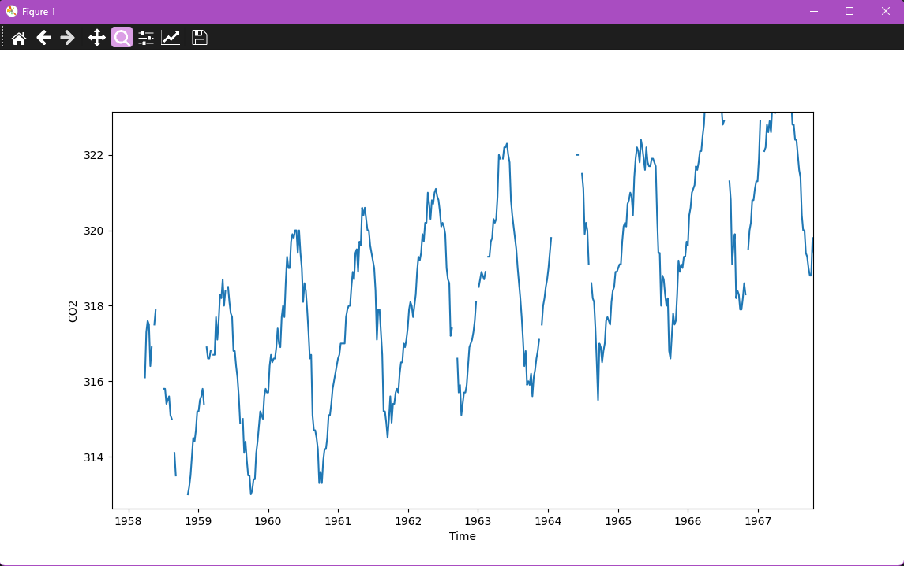
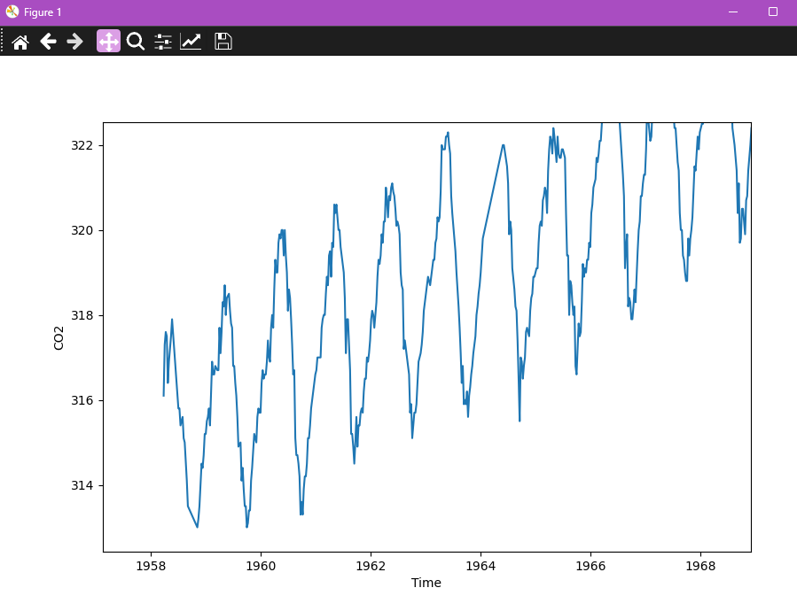
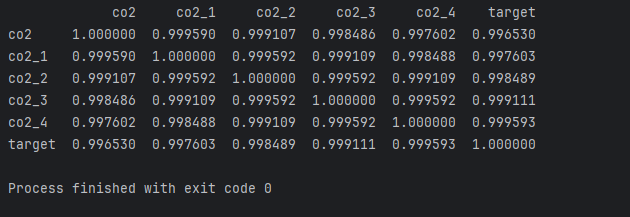
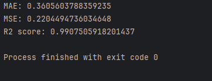
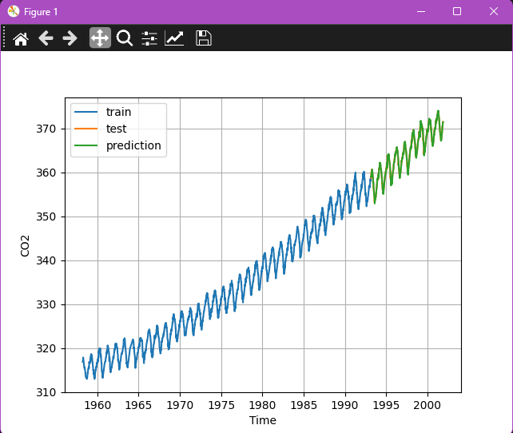
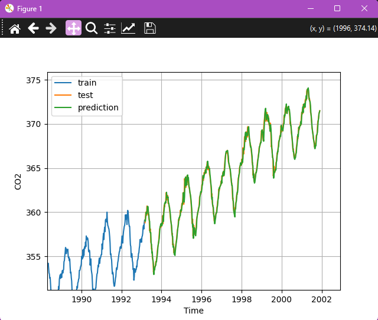
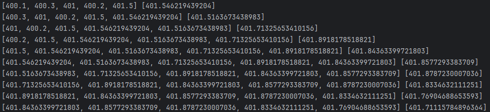
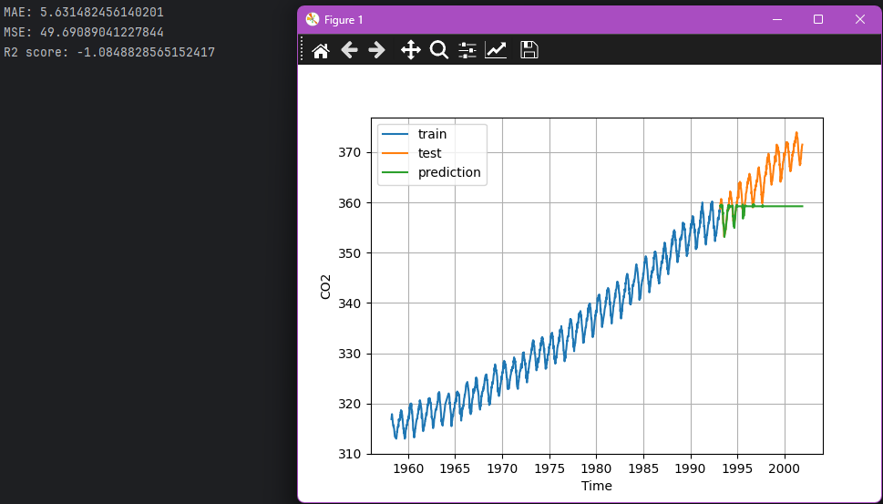

# Time Series Forecasting Exercise with CO2 Dataset

## 1. Introduction
Time Series Forecasting represents a dundamental problem in data science, where future values are predict based on historical observations. In this project, a forcasting model is developed to estimate CO2 Levels using time-dependent data.  

The dataset consists of weekly CO2 measurements collected from 1958 to 2001 and contains missing values, which require appropriate preprocessing before model training.  

This is my weekly exercise in Data Science - Machine Learning Course.  
***
## 2. Dataset Description
The dataset includes two primary variable:  
- time: timestamp
- co2: measured CO2 levels

Key characteristics: 
- Time-dependent structure (time-series)
- Presence of missing values
- Overall upward trend with seasonal fluctuations

***
## 3. Workflow Overview
The overall pipeline is structured as follows:
1. Data Loading
2. Data Visualization
3. Missing Value Handling
4. Feature Engineering (Sliding Window)
5. Train/Test Split (Time-based)
6. Model Training
7. Evaluation
8. Forecasting

***
## 4. Data Preprocessing
### 4.1 Convert Time Format
The time column is converted from strind format into datetime format to enable proper handling and visualization:  
```python
data["time"] = pd.to_datetime(data["time"], yearfirst=True)
```


### 4.2 Handling Missing Values
Several approaches are considered:
- Dropping missing values $\to$ breaks time continuity
- Mean/median imputation $\to$ introduces unrealistic patterns
- Interpolation $\to$ selected approach

```python
data["co2"] = data["co2"].interpolate()
```

Interpolation preserves the overall trend of the dataset without distoring its temporal structure.


---

## 5. Feature Engineering
Sliding Window Technique
To transform the time series into a supervised learning format, a sliding window approach is applied.
Concept:
- Use (n) past observations as input features
- Predict the next value as the target
For example, with a window size of 5:
- 5 previous values $\to$ features
- 1 next value $\to$ target
```python
def create_recursive_data(data, window_size=5): 
    i = 1 
    while i < window_size: 
        data[f"co2_{i}"] = data["co2"].shift(-i) 
        i += 1 
    data["target"] = data["co2"].shift(-i) 
    data = data.dropna(axis=0) 
    return data
```


***

## 6. Train-Test Split
Since time dependence must be preserved, random splittng is not appropriate.
Instead, the dataset is split sequentially:
- First 80% $\to$ training set
- Last 20% $\to$ testing set
This approach reflects real-world forecasting scenarios, where future values are predicted from past observations.

---

## 7. Model
### Linear Regression

A linear regression model is selected due to:
- High correlation among features
- Simplicity and effectiveness for structed tabular data

```python
from sklearn.linear_model import LinearRegression 

model = LinearRegression() 
model.fit(x_train, y_train) 

y_predict = model.predict(x_test)
```

---

## 8.Evaluation
The model performance is evaluated using:
- MAE (Mean Absoulute Error)
- MSE (Mean Squared Error)
- R2 Score
Result:
$R^2 \approx 0.99$, indicating excellent predictive performance.



---
## 9. Visualization
The results are visualized to campare:
- Training data
- Testing data
- Predicted values


```python
ax.plot(data["time"][:int(num_samples*train_size)], y_train, label="train")
ax.plot(data["time"][int(num_samples*train_size):], y_test, label="test")
ax.plot(data["time"][int(num_samples*train_size):], y_predict, label="prediction")
ax.set_xlabel("Time")
ax.set_ylabel("CO2")
ax.legend()
ax.grid()
plt.show()
```

Visualization provides an intuitive understanding of model performance and predection accuracy.





---

## 10. Recursive Multi-step Forecasting

To predict multiple future steps, a recursive forecasting approach is applied.
Concept:
- Each predict value is fed back as input for the next prediction
```python
sample_data = [400.1, 400.3, 401, 400.2, 401.5]

for i in range(10): 
    output = model.predict([sample_data]).tolist() 
    sample_data = sample_data[1:] + output
```



***

## 11. Results & Discussion
- Linear Regression performs effectively on this dataset
- Random Forest show poor performance due to its inability to extrapolate beyond training data
- Preserving temporal continuity is critical in time series modeling


---

## 12. Requirement
- Python 3.13
- Pandas
- Matplotlib
- Scikit-learn


